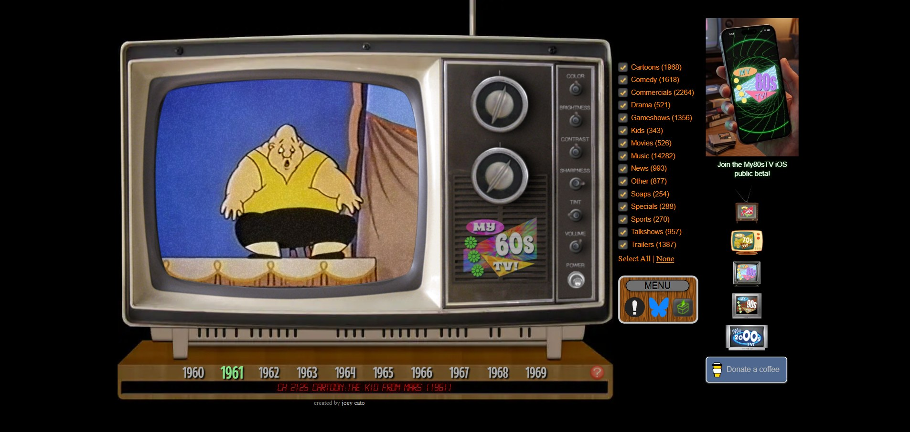
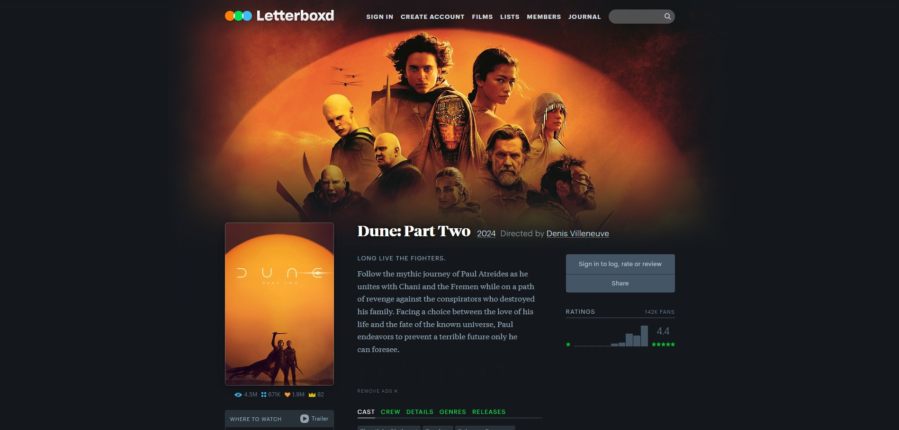
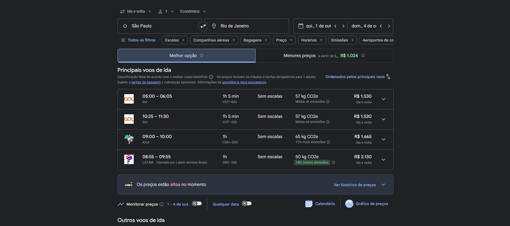

# References — Onde Passa

## 1. Objetivo

As referências abaixo orientam as decisões de experiência e interface do Onde Passa: a metáfora de TV e controle remoto, a página de detalhe do título e a forma de comparar onde assistir.

## 2. Referência 01 — MyRetroTVs

### Fonte
https://www.myretrotvs.com/

### Imagem

### O que observamos?
O site transforma navegação em "zapear": a pessoa escolhe uma TV de uma época e troca de canal pelo controle remoto, com chiado entre um canal e outro e o número do canal aparecendo na tela.

### O que vamos aproveitar?
A ideia de canal numerado, o controle remoto com CH+ e CH− e o chiado como transição.

### Como será adaptado?
No Onde Passa os canais são os streamings que a pessoa assina. Em vez de vídeo, a tela mostra uma grade de pôsteres do catálogo daquele serviço. O chiado dura pouco (menos de meio segundo) e aparece enquanto a API carrega, então ele também funciona como estado de carregamento. O número do canal usa uma fonte de matriz de pontos (Doto), como o visor de uma TV antiga. No celular, o controle vira uma barra fixa na parte de baixo da tela.

### Onde foi usado e por que é adequado?
Na página de Zapping (`/canal/:providerId`), nos componentes `TvScreen` e `Remote`, e no estado de carregamento de todo o site. É adequado porque ter vários streamings é parecido com ter vários canais: a metáfora explica o produto sem texto e transforma a espera da API em parte da experiência.

## 3. Referência 02 — Letterboxd

### Fonte
https://letterboxd.com/film/dune-part-two/

### Imagem

### O que observamos?
A página do filme tem um backdrop largo no topo que escurece nas bordas, o pôster sobreposto à esquerda, título grande com ano e direção logo ao lado, e uma coluna lateral com as ações e as notas.

### O que vamos aproveitar?
A hierarquia da página de detalhe: backdrop, pôster sobreposto, título em destaque e uma coluna lateral com a informação que ajuda a decidir.

### Como será adaptado?
A coluna lateral vira a área "Onde passa", com os grupos No seu controle, Em outros canais, Aluguel e Compra. O título usa a Radio Canada Big, fonte criada para uma emissora de TV, em vez de serifada, e o backdrop recebe scanlines leves para manter a linguagem de TV.

### Onde foi usado e por que é adequado?
Na página do título (`/titulo/:tipo/:id`), no `TitlePage` e no `ProviderGroup`. É adequado porque o Letterboxd é referência para quem acompanha filmes e séries, e essa organização deixa a informação de onde assistir ao lado do título, sem a pessoa precisar rolar a página.

## 4. Referência 03 — Google Voos

### Fonte
https://www.google.com/travel/flights

### Imagem

### O que observamos?
Cada opção de voo é uma linha com o mesmo formato. O dado que decide a escolha (o preço) fica alinhado à direita, e a melhor opção ganha destaque de cor e uma etiqueta ("14% menos emissões").

### O que vamos aproveitar?
Linhas comparáveis com o dado decisivo sempre no mesmo lugar e um destaque só para a melhor opção.

### Como será adaptado?
Cada streaming vira uma linha com logo e nome à esquerda e o tipo de acesso à direita (Incluso, Aluguel, Compra). Como a API não fornece preço, o que decide é se o título já está incluso nas assinaturas da pessoa: essas linhas ficam no topo, em verde, com as barras de sinal cheias e a etiqueta "No seu controle". Aluguel e compra ficam abaixo, em cinza.

### Onde foi usado e por que é adequado?
Nas seções de onde assistir da página do título, no componente `ProviderGroup`. É adequado porque o problema do produto é uma comparação (onde vale mais a pena assistir) e esse padrão de linhas com destaque da melhor opção é o que o Google Voos usa para facilitar a mesma decisão.
